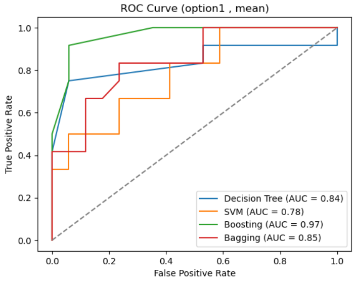
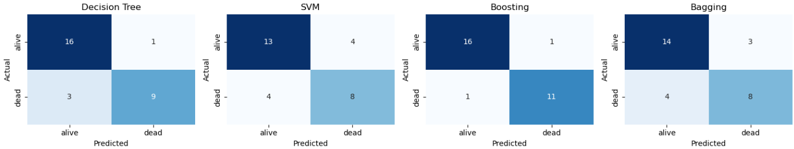
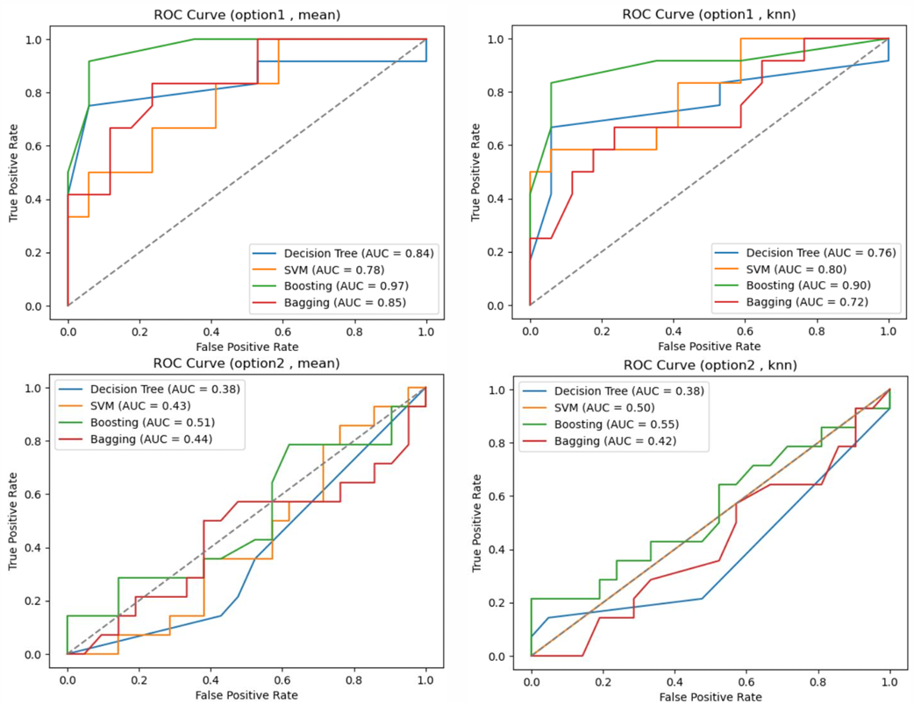

# Bone Marrow Transplant Survival Prediction Using Machine Learning

**Dataset:** ["Bone Marrow Transplant: Children" (UCI Machine Learning Repository)](https://archive.ics.uci.edu/dataset/565/bone+marrow+transplant+children)  

**Data Mining Final Project, Dec 2024, Tarbiat Modares University**  

**Supervisor:** Dr. Toktam Khatibi  
**Students:** Matineh Rangzan, Maryam Mokarizadeh  

---

## Introduction  

Bone marrow transplants are critical in treating pediatric blood diseases, but **predicting survival outcomes remains a complex challenge**. This project applies **machine learning techniques** to improve survival prediction for pediatric bone marrow transplant patients.  

The **Bone Marrow Transplant Dataset** contains **187 instances** and **36 features**, including **demographic, clinical, and laboratory data**. The goal is to develop a robust predictive model that can aid in **clinical decision-making**.  

- **Objective**: Predict **survival outcomes** (binary classification: survival or non-survival).  
- **Challenges**: Handling missing data, feature selection, and class imbalance.  

### **Feature Overview**  
The dataset includes both **numerical and categorical variables**, requiring preprocessing:  

- **Target Variable**: `survival_status` (binary: 1 = survived, 0 = non-survived).  
- **Feature Selection Approaches**:  
  - **Option 1:** Includes both pre- and post-transplant features.  
  - **Option 2:** Excludes post-transplant features (stricter model).  

---

## Dataset & Methods  

- **Source:** [UCI Machine Learning Repository](https://archive.ics.uci.edu/dataset/565/bone+marrow+transplant+children)  
- **Preprocessing Techniques**:  
  - **One-Hot Encoding** for categorical variables.  
  - **MinMax Scaling** for numerical feature normalization.  
  - **SMOTE** for handling class imbalance.  

- **Missing Data Imputation**:  
  - **KNN Imputation** (leverages feature relationships).  
  - **Mean Imputation** (simpler, but less adaptive).  

- **Feature Selection:**  
  - Used **SelectKBest (ANOVA F-test)** to select the **20 most relevant features**.  

---

## Models & Evaluation  

### **Machine Learning Models**  
- **Decision Tree**  
- **Support Vector Machine (SVM)**  
- **Boosting (AdaBoost with Decision Tree base classifier)**  
- **Bagging (with Decision Tree base classifier)**  

### **Performance Metrics**  
- **Accuracy, Precision, Recall, F1 Score**  
- **ROC-AUC Curve**  

---

## Results  

### **1. Model Comparison**  
Below is the **ROC Curve comparison** for different models, showcasing their classification performance using the best setting (Option 1 & Mean Imputation):  

  

### **Confusion Matrices for Different Models**  
The following confusion matrices illustrate the classification performance of different models:

  

### **Performance Summary (Option1 , Mean Imputation)**  

| Model          | Set  | Accuracy | Precision | Recall | F1 Score |
|---------------|------|----------|-----------|--------|----------|
| Decision Tree | Train | 0.771    | 0.885     | 0.771  | 0.824    |
| Decision Tree | Test  | 0.862    | 0.900     | 0.750  | 0.818    |
| SVM           | Train | 0.700    | 0.820     | 0.785  | 0.802    |
| SVM           | Test  | 0.724    | 0.667     | 0.667  | 0.667    |
| Boosting      | Train | 0.779    | 0.812     | 0.800  | 0.806    |
| Boosting      | Test  | 0.931    | 0.917     | 0.917  | 0.917    |
| Bagging       | Train | 0.743    | 0.986     | 0.986  | 0.986    |
| Bagging       | Test  | 0.759    | 0.727     | 0.667  | 0.696    |

### **Key Observations**  
- **Boosting consistently achieved the highest generalization performance.**  
- **Bagging displayed signs of overfitting**, excelling in training but struggling in test performance.  
- **SVM performed well but struggled in test set generalization compared to tree-based methods.**  
- **Decision Tree provided a strong baseline but was outperformed by ensemble methods.**  

---

### **2. Feature & Imputation Comparisons**  
This study also investigated the effect of **feature selection** (Option 1 vs. Option 2) and **imputation methods** (Mean vs. KNN) on model performance.

 

**Option 1 (Including Post-Transplant Features):**
- Models perform better due to the **inclusion of post-transplant** variables, which are strong predictors of survival outcomes.
- **Mean imputation** provides slightly better stability than KNN.

**Option 2 (Excluding Post-Transplant Features - Stricter):**
- Test performance drops significantly due to **removal of post-transplant** variables, which limits predictive information.
- **KNN imputation** is slightly better than mean, but the overall feature set remains too weak for effective learning. 
---

## Conclusion  

### Best Performance

- **Classifier**: Boosting  
- **Option**: Option1 (with post-transplant features)  
- **Imputer**: Mean Imputer

**Why**: Boosting demonstrated the best balance between training and testing, maintaining strong generalization and stability. It outperformed other models by effectively capturing patterns in the data while avoiding overfitting, making it the most reliable choice.

## Future Work

Option 1 is preferable for predictive tasks involving survival outcomes, as it includes critical post-transplant variables.
If strict exclusions are necessary (Option 2), additional strategies are needed to compensate for the loss of predictive power:
- **External Data:** Incorporate supplementary datasets to enhance the input features.
- **Better Classifiers:** Utilize more advanced models like deep learning or ensemble methods (e.g., Gradient Boosting, Random Forests) that can uncover complex patterns in the limited feature space.